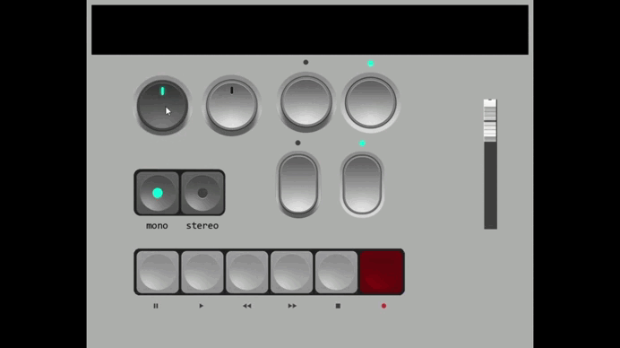

# ControlPanel


ControlPanel is a learning project, which is a virtual control panel created to study CMake projects in C++ and work with the SFML graphics library. The remote control includes various controls such as potentiometers, buttons, switches and a slider.

## Content

- [Description](#description)
- [Functions](#functions)
- [Technology](#technology)
- [Installation](#installation)
- [Usage](#usage)
- [Screenshots](#screenshots)
- [Contacts](#contacts)
- [License](#license)

## Description

ControlPanel is a learning project that does not carry any value, but serves to learn how to work with CMake and the SFML graphics library in C++. The control panel includes various controls such as potentiometers, buttons, switches and sliders. Some actions are accompanied by the display of values on the mini-screen of the remote control.

## Functions

- Two potentiometers that can be rotated.
- Two buttons and two switches.
- Slider to adjust the values.
- Various buttons that are clamped when pressed and released when a certain other button is pressed.
- Display values on the mini-screen of the remote control when performing certain actions.

## Technology

- **Programming language:** C++
- **Libraries:** SFML
- **Assembly System:** CMake

## Installation

1. Clone the repository:
```sh
 git clone https://github.com/your_username/ControlPanel.git
 cd ControlPanel
```
2. Install the dependencies:
  - Make sure you have CMake installed.
  - Install the SFML library.
3. Compile the project
```sh
mkdir build
cd build
cmake ..
make
```
4. Launch the app:
```sh
./ControlPanel
```

## Usage
- Use the mouse wheel to rotate the potentiometers.
- Click on the mouse buttons to activate them.
- Click on the switches with the mouse to activate them.
- Drag the slider with the mouse to adjust the values.

## Screenshots


## Contacts

If you have any questions or suggestions, please contact me.:

- **Email:** dev.assist@yandex.ru
- **GitHub:** [S0s0Combain](https://github.com/S0s0Combain)

## License

This project is licensed under the [MIT License](LICENSE).